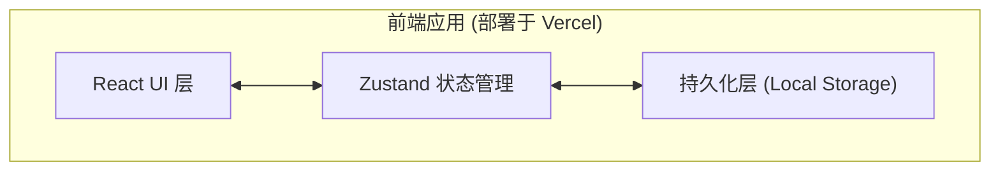
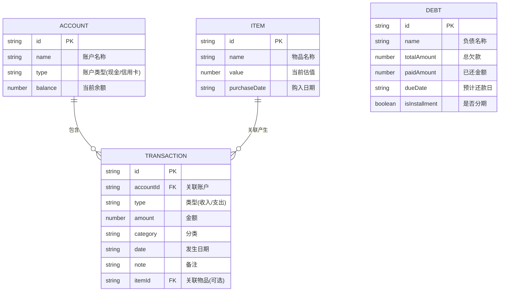

## 1. 架构设计
本应用采用纯前端架构，数据通过浏览器本地存储（Local Storage）进行持久化，方便无服务器环境下直接部署到 Vercel 平台。



## 2. 技术说明
- **前端框架**：React@18 + TypeScript + Vite
- **初始化工具**：vite-init (使用 `react-ts` 模板)
- **样式与动画**：Tailwind CSS @3 + Framer Motion (提供丝滑微动效)
- **图标库**：lucide-react
- **状态管理**：Zustand (结合 persist 中间件实现数据本地持久化)
- **路由**：React Router DOM (前端路由)
- **时间处理**：date-fns (用于日历计算和收支时间格式化)

## 3. 路由定义
| 路由 | 用途 |
|-------|---------|
| `/` | 首页/总览页面（包含仪表盘和日历视图） |
| `/assets` | 资产管理页面（现金、信用卡等账户管理） |
| `/transactions`| 收支记录页面（所有收支明细及增删改查） |
| `/items` | 物品管理页面（记录高价值物品） |
| `/debts` | 负债管理页面（待还记录及还款计划） |

## 4. 数据模型
由于是纯前端应用，数据主要存储在 Zustand 状态树中，并持久化到 Local Storage。

### 4.1 数据模型定义


### 4.2 核心状态结构 (TypeScript)
```typescript
interface Account { id: string; name: string; type: 'cash' | 'credit'; balance: number; }
interface Transaction { id: string; accountId: string; type: 'income' | 'expense'; amount: number; category: string; date: string; note?: string; itemId?: string; }
interface Item { id: string; name: string; value: number; purchaseDate: string; }
interface Debt { id: string; name: string; totalAmount: number; paidAmount: number; dueDate: string; isInstallment: boolean; }

// Store state
interface AppState {
  accounts: Account[];
  transactions: Transaction[];
  items: Item[];
  debts: Debt[];
  // Actions
  addTransaction: (t: Omit<Transaction, 'id'>, createItem?: boolean) => void;
  // ...other actions
}
```
