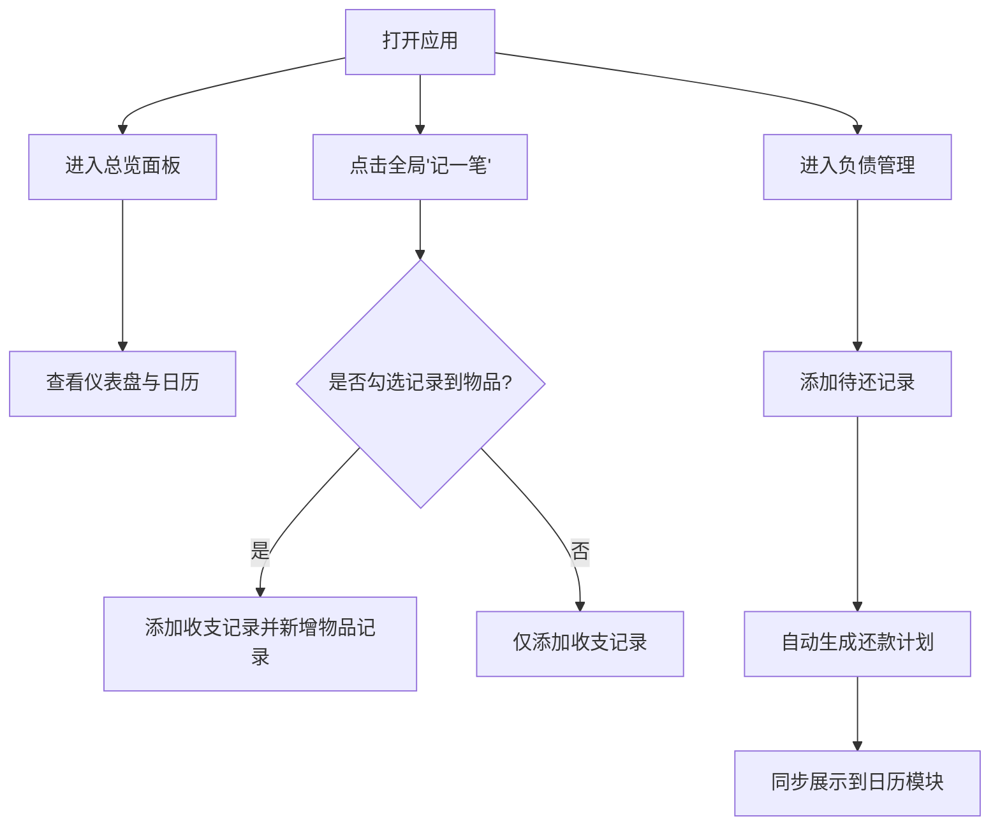

## 1. 产品概述
这是一款设计精良、可部署到 Vercel 平台的个人财务记账工具。
- 旨在帮助用户高效地进行全面的个人资产和收支管理，包含资产、负债、物品价值的综合统计，解决多账户管理与复杂财务规划的痛点。
- 采用现代化、响应式的设计，提供直观的仪表盘和日历视图，为用户创造清晰、美观且实用的财务记录体验。

## 2. 核心功能

### 2.1 用户角色
| 角色 | 注册方式 | 核心权限 |
|------|---------------------|------------------|
| 普通用户 | 暂无（本地存储/单机版部署） | 浏览所有模块并进行数据的增删改查 |

### 2.2 功能模块
1. **总览**：数据总览、日历视图、仪表盘信息
2. **资产管理**：现金、信用卡等账户的创建与管理
3. **收支记录**：收支明细的增删改查，并与账户和日历关联
4. **物品管理**：记录已有物品及其价值
5. **负债管理**：添加待还记录，自动生成还款计划，并在日历中体现
6. **记一笔（全局悬浮窗）**：快速记录收支，支持勾选“记录到物品”以同步新增物品数据

### 2.3 页面详情
| 页面名称 | 模块名称 | 功能描述 |
|-----------|-------------|---------------------|
| 首页/总览 | 数据仪表盘 | 展示总资产、总负债、净资产及本月收支概况 |
| 首页/总览 | 日历视图 | 按月显示每天的收支总额及负债还款提醒 |
| 资产管理 | 账户列表 | 罗列现金、信用卡等账户及其当前余额，支持添加新账户 |
| 收支记录 | 明细列表 | 按时间倒序排列的收支记录，支持筛选和增删改查 |
| 物品管理 | 物品列表 | 记录用户高价值物品名称、购入时间、当前估值等 |
| 负债管理 | 待还列表及计划 | 添加分期或一次性负债记录，自动生成未来的还款计划 |
| 全局组件 | 记一笔浮窗 | 全局点击弹出的表单，填写金额、分类、账户，可勾选同步为物品 |

## 3. 核心流程
用户通过全局悬浮按钮点击“记一笔”，填写金额、类型（收入/支出）、关联账户。如果勾选“记录到物品”，系统会在收支记录生成的同时，在“物品管理”中新增对应的物品资产。如果是分期负债，用户在负债管理中添加记录，系统自动计算还款计划，并将每期还款金额展示在总览的日历视图中。

## 4. 用户界面设计

### 4.1 设计风格
- **主色调与配色**：采用克制的高级感配色（如深色模式或干净的极简白底），搭配区分收支的强调色（如薄荷绿代表收入，珊瑚红代表支出）。
- **按钮样式**：圆角矩形，悬浮带有细腻的阴影和微动效（使用 Motion）。
- **字体与排版**：标题采用无衬线几何字体（如 Inter 或 system-ui 搭配特殊的 Display 字体），注重留白与层级关系。
- **布局风格**：卡片式布局，侧边栏导航或顶部导航，注重空间组合的非对称美感和网格对齐。

### 4.2 页面设计概览
| 页面名称 | 模块名称 | UI 元素 |
|-----------|-------------|-------------|
| 总览 | 仪表盘 | 大号数字字体，平滑过渡的统计图表，日历网格带有微小的圆点标记 |
| 记一笔 | 悬浮表单 | 毛玻璃（Glassmorphism）效果背景，大且易点击的输入框和切换拨动开关 |
| 资产/物品/负债 | 列表卡片 | 列表项带有平滑的 Hover 效果，重要信息使用强调色，结构清晰紧凑 |

### 4.3 响应式设计
- 桌面端优先：采用侧边栏+主内容区的宽屏布局，仪表盘与日历并排显示。
- 移动端适配：导航转为底部 Tab，日历和列表变为上下单列布局，悬浮按钮固定在右下角，触控热区放大。
